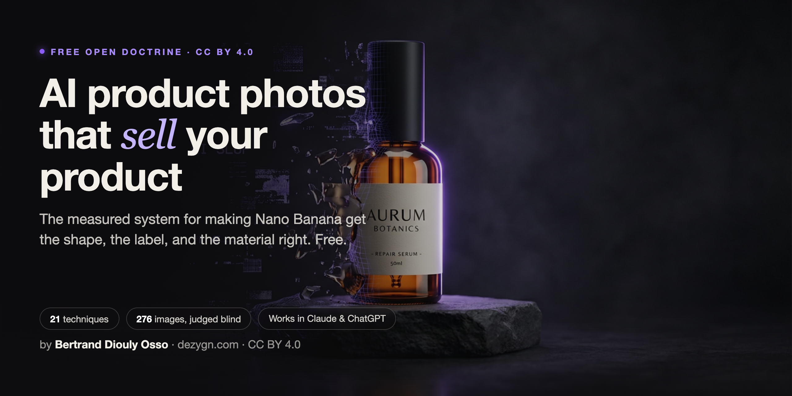

# AI Product Photography Accuracy

  

<strong>Nano Banana makes your product beautiful, then quietly gets the bottle, the label, or the fabric wrong.</strong> <em>This is the blind-judge-measured system that fixes it, on the Nano Banana family and any image model after it.</em>

  
  
  
  

⭐ If this gets Nano Banana to respect your product, [star the repo](https://github.com/youzignb/ai-photography-accuracy) so the next owner drowning in "close enough" can find it.

> **Came from the video?** Start with [SKILL.md](SKILL.md), the compact doctrine. Add it to Claude or ChatGPT as a skill and your agent runs the whole method for you. Every deep dive linked below stays free.

You spin up a product shot and it looks incredible. Then you look closer. The bottle is the wrong shape. The label reads like gibberish. The linen shines like plastic. So you rewrite the prompt and spin again, and again, hunting for the one that finally looks like YOUR product. That is not a workflow. That is a slot machine. And "close enough" is not a style choice. Close enough is a two-star review, "item not as pictured," and a refund. This repository is the fix, and it does not stop at prompt-phrase tricks. You name the exact defect, route it to the technique built for it, and lean on evals run on Nano Banana and judged blind instead of hope. It is free, and it comes from a working practice that ships these images for money. The goal is Conversion Integrity, an AI product image a customer would accept as the real product: Accuracy plus Realism plus Branding.

## Highlights

- **Stop guessing which prompt worked.** Every rule here is backed by a controlled eval run on the Nano Banana family with a blind judge, so you copy what was measured, not what someone hopes usually works.
- **Know the fix before you burn 10 generations.** The diagnosis-first Route Map names the defect on 8 fidelity axes and dispatches it straight to the right technique, instead of rewriting the whole prompt and rolling again.
- **Get language for the problems that used to have no name.** Named, reusable concepts (Visual Syntax, Lock-and-Outpaint, Shannon Descent, Blueprinting) turn "it just looks off" into a defect you can point at and clear.
- **Go as deep as you want, at no cost.** Every technique links to its full canonical treatment at dezygn.com/resources, free.
- **Hand it to your AI and let it do the work.** `SKILL.md` drops into Claude or ChatGPT as a skill your agent follows directly on any product-accuracy task.
- **Learn the method that people actually pay for.** This is distilled from a real product-photography operation and the Dezygn platform, not theory written in the abstract, so store owners sell more and freelancers can charge for the skill.

## Table of contents

- [Who made this](#who-made-this)
- [What is inside](#what-is-inside)
- [Techniques at a glance](#techniques-at-a-glance)
- [How to use it](#how-to-use-it)
- [The vocabulary coined here](#the-vocabulary-coined-here)
- [Where to go next](#where-to-go-next)
- [Canonical source](#canonical-source)
- [License](#license)

## Quick start (for real work, not just reading)

To generate accurate AI product images with this skill you need one thing beyond the doctrine: API access to a current image model that accepts reference images. We recommend [fal.ai](https://fal.ai) (key in `FAL_KEY`) running the Nano Banana family: the Lite tier for cheap iteration, the standard tier for candidates, the Pro tier for 4K finals. The skill tells the agent to look up current endpoint names at run time, so this repository stays correct even when models get renamed. Details in [SKILL.md, section 7](SKILL.md).

## Who made this

Bertrand Diouly Osso, founder of [Dezygn](https://dezygn.com). This library is the distilled doctrine behind a working product-photography practice and the Dezygn platform, built for anyone who needs accurate AI images at production scale. It is published openly so the method for accurate AI product photography can be learned, cited, and built on.

## What is inside

- **[SKILL.md](SKILL.md)** - the compact operating doctrine: the foundations (the laws), Visual Syntax v2.0, the diagnosis-first Route Map, the measured decision rules, judging, and the manual handoff.
- **[references/techniques.md](references/techniques.md)** - one section per technique: when to use it, the core moves, and a link to its full treatment.
- **[references/evals.md](references/evals.md)** - the measured findings: the dimension, material, word-order, and one-shot-versus-chaining evals, with numbers and conclusions.

## Techniques at a glance

Flagship techniques from the library. Full list, moves, and canonical links: [references/techniques.md](references/techniques.md).

| Technique | What it does |
|---|---|
| [Clean Reference](references/techniques.md#clean-reference) | Prepares the source image so the model has nothing left to guess. |
| [Angle Bank](references/techniques.md#angle-bank) | Captures the full 360 once so any future angle is already covered. |
| [Stand-In Technique](references/techniques.md#stand-in-technique) | Creates a missing pose or fit reference using a stand-in, identity supplied elsewhere. |
| [Lock-and-Outpaint](references/techniques.md#lock-and-outpaint) | Freezes the product's pixels and paints only the world around them: never redrawn, never wrong. |
| [Blueprinting](references/techniques.md#blueprinting) | Locks an image in words so a layout can be edited and regenerated with surgical control. |
| [Shannon Descent](references/techniques.md#shannon-descent) | Shrinks a failing image to its smallest broken piece, solves it alone, then rebuilds around it. |
| [Pose-Match](references/techniques.md#pose-match) | Transforms a product one step at a time instead of asking one generation to do everything. |
| [Control vs Variant Pipeline](references/techniques.md#control-vs-variant-pipeline) | Prompt engineering as version control: lock a control, test one isolated change at a time. |
| [Dimension Control](references/techniques.md#dimension-control) | Five tools for fixing wrong size and proportion, the model's blind spot for real-world scale. |
| [Material Fidelity](references/techniques.md#material-fidelity) | Translates a client's material into the words the model has actually seen a million times. |
| [Edit Grammar](references/techniques.md#edit-grammar) | Action plus Target plus Integration, the formula that separates a professional edit from a wish. |
| [Draft Cheap, Finish Expensive](references/techniques.md#draft-cheap-finish-expensive) | Two dials, variation count and model tier, turned up only as confidence in the direction rises. |

## How to use it

**As a Claude skill.** Drop this repository into your skills directory. `SKILL.md` carries the frontmatter and doctrine an agent follows for AI image generation work; the `references/` files are loaded when depth is needed. It triggers on AI product photography and product-accuracy tasks.

**As a reading course.** Start with `SKILL.md` top to bottom: the laws, then the six ingredients, then the Route Map (the heart), then the four measured rules. Reach for `references/techniques.md` when a specific technique comes up, and `references/evals.md` when you want the evidence behind a rule.

## The vocabulary coined here

Named terms from this system, most of them published nowhere else:

- **Visual Syntax** - the six ingredients (Style, Subject, Action, Scene, Camera, Brand) and the three rules that turn prompting from description into assembly.
- **Conversion Integrity** - Accuracy plus Realism plus Branding, the trio a client actually buys.
- **The Route Map** - diagnosis on 8 fidelity axes dispatching to one technique. Many ways to cook the same dish.
- **Dimension Blindness** and the **Magnitude Ladder** - the model knows relative magnitude, never centimeters, and the weird/normal/unsure rule for steering size.
- **Material priors** (correct, wrong, ambiguous) - the measured classes that decide whether texture words can work at all.
- **Lock-and-Outpaint** - freeze the pixels, paint the world around them. Never redrawn means never wrong.
- **Blueprinting** - lock the image in words, edit the words, regenerate.
- **Shannon Descent** - isolate the smallest failing piece, solve it alone, rebuild around it.
- **Pose-Match** and the **Angle Bank** - create the missing angle by transformation, and capture the full 360 once so accuracy is available forever.
- **Comp Card** and the **Clean Portrait Rule** - synthetic models for consistency, composited only from a clean master.
- **Control vs Variant Pipeline** and **Micro-Iterations** - prompt engineering as version control, down to rolling many dice at one failing word.
- **Draft Cheap, Finish Expensive** - two dials, variation count and model tier, turned up only as confidence rises.
- **Edit Grammar** - Action plus Target plus Integration, where the integration line separates pro from amateur.
- **Manual Handoff** - AI builds 90%, the last 10% of truth is applied by hand.
- **Count errors** as a named product-accuracy defect class, alongside silhouette, proportions, text, graphics, material, color, and construction.

## Where to go next

- **Try the techniques on rails.** Generate accurate product photography with these methods built into the product: [dezygn.com](https://dezygn.com).
- **Learn the craft.** Free 5-lesson training and community: [AI Photography Agency on Skool](https://www.skool.com/ai-photography-agency-4309/about).
- **Hire the author.** Work with Bertrand directly: [Upwork profile](https://www.upwork.com/freelancers/~01a8e4c27dbf06e019).

## Canonical source

The full technique treatments live at **dezygn.com/resources**. This repository teaches the what and the why compactly; the articles carry the depth. Every technique section links to its canonical article.

## License

Licensed under [Creative Commons Attribution 4.0 International (CC BY 4.0)](LICENSE). You may share and adapt this material, including commercially, provided you give attribution. Cite as: **Bertrand Diouly Osso / dezygn.com**.

---

⭐ Made an image a customer would accept as the real thing? [Star it](https://github.com/youzignb/ai-photography-accuracy) so more people find a measured way to do this.
