# Technique Library

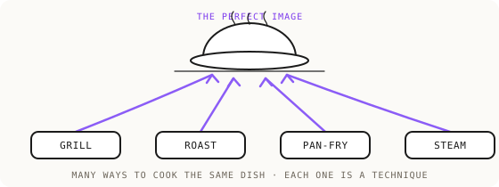

One section per technique: the canonical name, when to use it, the core moves, and where the full treatment lives. The repository teaches the what and the why compactly. The depth lives at dezygn.com/resources, which is the canonical source for every full treatment.

Organizing principle: there are many ways to cook the same dish. Several techniques reach the same result; the Route Map (in SKILL.md) decides which to use.

---

## Source preparation

### Clean Reference
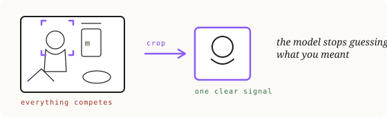

**When:** always, before the model ever sees an input. The number one source-preparation technique.
**Core moves:** A reference communicates everything it contains, so a busy or weak reference makes the model guess. Two stages. At capture: even lighting, neutral background, small details (text, hinges) sharp and large in frame, and shoot the Angle Bank. Downstream: crop to keep ("if you are not trying to keep it, remove it"), upscale to at least 2K long edge with critical text at least 100px tall, strip noise (props, hands, neighbors, backgrounds), angle-match the reference to the intended output, and crop to the output's aspect ratio. Ten seconds of cropping beats an hour of prompting.
**Full treatment:** https://dezygn.com/resources/product-accuracy-nano-banana

### Clean Ingredients
**When:** any shot built from more than one element.
**Core moves:** Every ingredient in a shot gets one clean, isolated master, and you only ever composite from the masters. A shot with a model, a second model, a product, and a background needs four clean masters. Model becomes a clean portrait (plain background, plain shirt, no accessories); product becomes a clean packshot on white; scene becomes an approved empty stage; any logo or illustration is isolated on neutral at correct resolution. The masters are permanent, named, reused across every drop.
**Full treatment:** https://dezygn.com/resources/product-accuracy-nano-banana

### Angle Bank
**When:** whenever the physical product is in hand at capture time. The capture-stage unlock.
**Core moves:** Shoot at least 10 angles around the 360 axis in good light on a clean background: front, back, left, right, both front three-quarters, both back three-quarters, top, plus close-ups of every text, logo, and hardware detail. Capture minutes now buy years of production accuracy, because every future composition has its angle-matched source waiting, which keeps Lock-and-Outpaint available. Missing angles can be synthesized (Pose-Match), but the AI does not know what it does not know: ask for the back of a product it has never seen and it invents one, so every synthesized angle must be approved against reality before it enters the bank. Soft or configurable products (bedding, apparel) generalize from angles to canonical states times angles, plus texture close-ups.
**Full treatment:** https://dezygn.com/resources/product-accuracy-route-map

### Stand-In Technique
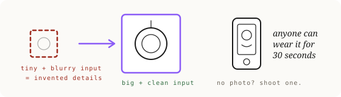

**When:** you hold the physical product but have no photo of the state you need (worn, half-folded, tilted, arranged). The camera route in the "create the missing reference" family.
**Core moves:** Photograph anyone (yourself, a friend) wearing, holding, or arranging the product, and use that photo purely as a fit and pose reference: proportions, scale, position. Identity comes from elsewhere. The AI does not care about the stand-in, only the product. Precondition: someone must actually hold the product, often the client rather than you. When nobody can, fall back to Lock-and-Outpaint or a proven past prompt. Advanced version, the 4-image role assignment: [image1] a real person wearing the item for FIT, [image2] the model's headshots for IDENTITY, [image3] the environment for SETTING, [image4] the product on white for DESIGN. Separation of concerns: each image does one job.
**Full treatment:** https://dezygn.com/resources/pose-match

### Comp Card Technique
**When:** you need a consistent synthetic model across shots and drops.
**Core moves:** Create reusable synthetic models as comp cards (white or grey background, plain white tee, no accessories, multiple angles); name, tag, and save them as ingredients. The Clean Portrait Rule is the heart of it: always generate a clean portrait variant and composite only from it, never from a styled comp card, because the source wins over the prompt and any clothing, background, or accessory in the source pollutes the composite. The comp card is for choosing the model; the clean portrait is the only thing you composite from. Model realism cues: stack facial features, use "youthful" for accurate young ages, control emotion volume ("quiet joy", not raw emotion words), and add anti-plastic cues (visible pores, slight asymmetry).
**Full treatment:** https://dezygn.com/resources/comp-cards

---

## Transfer and locking

### Lock-and-Outpaint
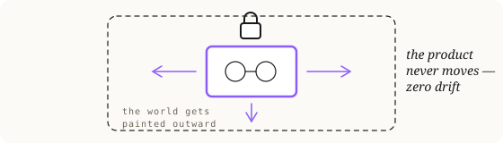

**When:** product-on-surface shots, or any job where fidelity is non-negotiable and the angle can stay fixed. The highest-accuracy route there is.
**Core moves:** Keep the product image pixel-locked in place and outpaint the environment around it. Because every redraw can drift, never redrawn means never wrong means zero drift. The only thing you ask the model to blend is the light. Prompt skeleton: a lock clause (exact position, crop, angle, "completely unchanged, do not regenerate"); an outpaint clause (surface and environment, plus camera repositioning if needed); an integration clause (lighting direction and color temperature matched to the locked product, realistic contact shadows); an optional realism layer. From one frozen studio shot you get a whole series: the same untouched product on wood, silk, concrete, leather. Gated only by angle coverage, which is why the Angle Bank is its upstream unlock.
**Full treatment:** https://dezygn.com/resources/lock-and-outpaint

### Blueprinting
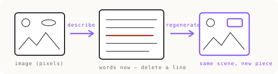
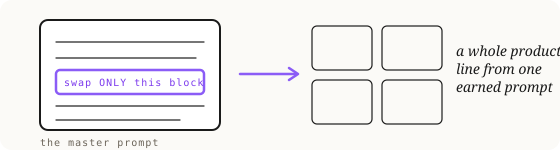

**When:** a scene must be rebuilt around one replaced thing, or you need word-level control over a layout that only exists as pixels.
**Core moves:** Lock the image in words. Pixels are hard to edit; words are easy. Draw the blueprint (ask the model to describe the image so completely the description alone could recreate it), edit the blueprint (delete the sentences describing the thing to replace, keep every other sentence exactly, which cuts a hole shaped like the old thing), then regenerate with the new element attached to fill the hole. The numbered-entity description style (every duplicate object indexed: "woman 2, chair 3, decanter 2") is what makes recreations controllable. The blueprint becomes a reusable master that carries a whole product line through one scene. Also escapes the resolution ceiling of a low-res source by regenerating from description.
**Full treatment:** https://dezygn.com/resources/visual-syntax

### Composition Transfer
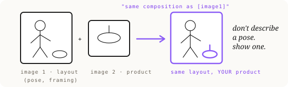

**When:** a perfect layout already exists and fit, identity, and design all matter.
**Core moves:** Attach the layout or pose reference and copy its spatial arrangement. The magic line is "use the same composition as [image1]": the layout image carries the arrangement, your product image carries the content, your words carry only the context. Even an imperfect transfer beats describing a layout in words. Part of the four transfer techniques (Product, Composition, Style, Full).
**Full treatment:** https://dezygn.com/resources/visual-syntax

---

## Decomposition

### Sequential Pipeline
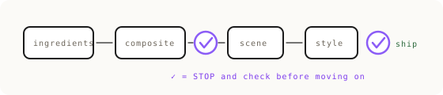
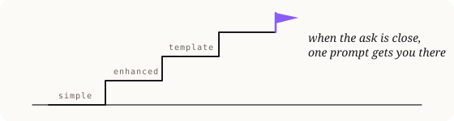

**When:** a job needs control over its parts (person plus product plus scene at once, eyewear, jewelry, transparent materials). Chain for control, not by default.
**Core moves:** Complex images are not one problem, they are several sequential problems, and each step must produce a validated intermediate asset before the next begins. The five course steps: select your clean ingredients; composite model plus product (clean portrait plus clean packshot only, validate accuracy here); place the composite into the scene; apply style and action; run the quality check. The gate discipline: stop at each step and confirm the product, fit, and face are right, because a mistake carried forward poisons everything after it. Separate the stages across sessions so context does not bleed between them. Skip the composite step for simple products; do it religiously for eyewear and small branded details.
**Full treatment:** https://dezygn.com/resources/sequential-pipeline

### Shannon Descent
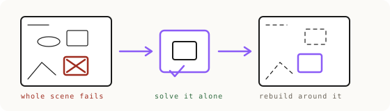

**When:** you do not know what is failing, or every fix inside the full scene fails anyway. The diagnostic sibling of the Sequential Pipeline.
**Core moves:** Shrink the problem until it cannot hide. Throw away everything except the smallest piece that still fails, perfect it alone, then rebuild the scene around the solved anchor, checking it survives each step. A complex scene is a crowd of instructions competing for attention; isolated, the model pours all its attention into the one piece and you can finally see whether it is right. You can shrink down to a single element or even a single instruction. Example: lettering wrong in every composite, so generate the lettering alone on white with its true material, perfect it, then composite it in. Named for Claude Shannon's method of reducing a big problem to its smallest part.
**Full treatment:** https://dezygn.com/resources/product-accuracy-route-map

### Pose-Match
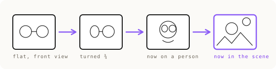

**When:** the product must appear differently than your photo shows it (different angle, worn, opened, stacked). The AI route for creating the missing reference.
**Core moves:** Transform the ingredient first, one small step at a time, instead of asking one generation to do everything. Glasses shot head-on, needed on a model outdoors: transform just the photo ("show these glasses in three-quarter view"), check it; use that output as the reference ("a man wearing these glasses, close-up"), check the fit; then place him outdoors, by which point the glasses are already correct and never mentioned. Angle-matching is the core: most accuracy errors happen when the model must rotate a product it has only seen from one side, so it invents the hidden side wrong. Front pose gets a front reference; three-quarter pose gets a three-quarter reference. When the angle does not exist, create it, approve it, and save it forever. Measured in one narrow test (single product, sharp reference, single placement): with a sharp reference, one jump beat chains. That is scoped, not a ruling that chaining is lesser. One-shot and the Sequential Pipeline are peer techniques with different jobs; chain when the job needs control, for angle creation, control gates, or model consistency across a series.
**Full treatment:** https://dezygn.com/resources/pose-match

---

## Iteration and wording

### Control vs Variant Pipeline
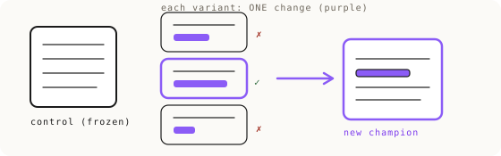

**When:** your prompt almost works and you know or suspect which thing is wrong.
**Core moves:** Prompt engineering as version control. Lock an immutable Control Base (composition, layout, camera) and never edit it during the experiment. Test isolated variants appended like feature flags, one change each (lens physics, material precision, tonal cues), scoring each against the control as better, worse, or same. Winners fold into a new champion; repeat. This solves the failure mode of rewriting whole prompts, which causes token overcrowding and semantic leaking (the layout shifts when you only wanted a texture change). When variants dilute the style, move the priority tokens to the front (the Calibration Layer). Best gains come from small physical cues stacked together, not one heavy stylistic effect.
**Full treatment:** https://dezygn.com/resources/control-vs-variant

### Micro-Iterations
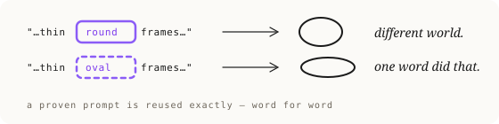

**When:** you have narrowed the failure to one word or one detail.
**Core moves:** Do not retry the same prompt; vary only the language around the problem area while keeping everything else stable. Generation is a dice roll, so roll many dice all aimed at the same one word: "elongated oval", "narrow oval", "flattened oval", "slim oval". Run 10 to 15 variations; two or three will land. Retrying the same prompt is the slot machine; micro-iterating is directed search. The lightweight in-session version of Control vs Variant.
**Full treatment:** https://dezygn.com/resources/control-vs-variant

### Dimension Control
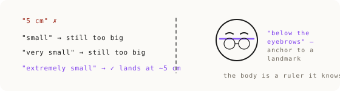
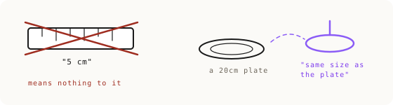

**When:** size or proportions render wrong. The technique kit for the dimension-blindness law.
**Core moves:** The model knows relative magnitude, never centimeters. Five tools, used together. Magnitude ladder: escalate the size word until reality matches ("small" to "very small" to "extremely small"), keeping both the number for humans and the winning word for the model. Comparison anchoring: chain to ONE clean singular object the model knows cold. Landmark anchoring: use the body or the product's own parts as the ruler ("top rim clearly below the eyebrows, visible strip of skin between brow and frame"). Shout and forbid: capitals plus the named blocked mistake ("CRITICAL: only 4cm tall, NOT tall aviator-style frames"). Sketch it: a rough drawing speaks the model's native visual language. See the measured weird/normal/unsure rule in evals.
**Full treatment:** https://dezygn.com/resources/size-control

### Material Fidelity
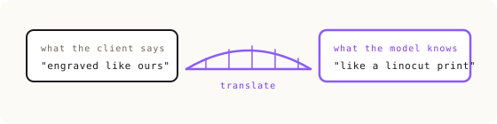

**When:** a material reads wrong.
**Core moves:** Translate what the client means into words the model has seen a million times. Six moves. Material analogies: describe a finish as a famous craft or process, not the client's term ("grooves pressed like a linocut print, filled with matte enamel"). Forbid by name: every named exclusion closes a door ("no sheen, no shine, no satin gloss"). Real names beat adjectives: a real film stock, not "vintage look"; a real camera and lens, not "professional photo". Build the client glossary first: collect the client's own technical vocabulary before generating. Hunt the one wrong word: when it is almost right, ask which near-twin is wrong (engrave, emboss, intaglio pull different shapes), then burst it with Micro-Iterations. Steal proven wording: reuse a phrase that worked whole. See the measured three-prior-classes rule in evals.
**Full treatment:** https://dezygn.com/resources/material-fidelity

### AI Realism Techniques (the Realism Stack)
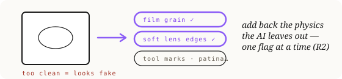

**When:** the image looks fake and you need to break the "that is AI" tell.
**Core moves:** Realism is a collection of small physical cues stacked together, not one heavy effect, and each cue must be tested one at a time via Control vs Variant, keeping only what visibly helps. For people: kill the plastic look ("visible skin pores, subtle skin texture, raw photo, unretouched"), add fine detail ("peach fuzz, slight under-eye shadows"), use camera physics (real camera and lens names, shallow depth of field, subtle film grain, realistic dynamic range), and ban the plastic-trigger words ("perfect skin, flawless, airbrushed, porcelain, hyper-realistic"). Deliberately imperfect light reads as authentic: uneven falloff, dual-source conflicts.
**Full treatment:** https://dezygn.com/resources/material-fidelity

### Edit Grammar
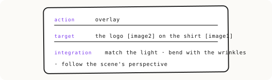

**When:** you are changing an existing image rather than creating one.
**Core moves:** Creating describes the picture you want; editing describes the change. Write a work order, not a wish. Formula: Action plus Target plus Integration. Action verb (remove, replace, add, overlay, extend, recolor); exact target with image roles ("overlay the logo [image2] centered on the chest of the t-shirt [image1], about 15% of the shirt's width"); and the integration line, which is the entire difference between amateur and pro: how the change blends in through light, color, texture, and perspective. "Add a coffee cup on the table" is amateur. "Add a white ceramic cup on the wooden table, bottom right, lit from the upper left to match the existing shadows, with a soft reflection on the polished wood" is professional.
**Full treatment:** https://dezygn.com/resources/product-accuracy-nano-banana

### Draft Cheap, Finish Expensive
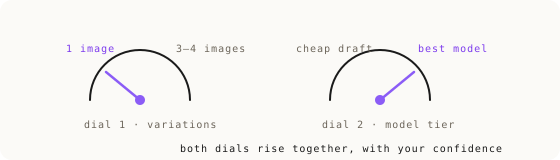
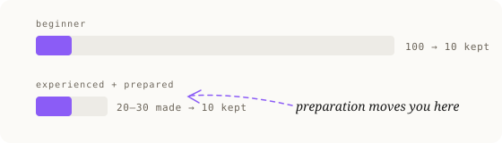

**When:** you are still choosing direction, or scaling variation count to task difficulty.
**Core moves:** Two dials on one axis, how sure you are of the direction. Dial one, variation count: while exploring, one image at a time (extra copies of an unproven idea are waste); once the direction is locked, run variations of the winning prompt and pick the best of the litter. Plan 3 to 6 variations for easy tasks, up to 10 for borderline or hard ones. Past 10 on the same prompt, the prompt is the problem, not the dice, so switch technique. Dial two, model tier: draft on a cheap fast model while deciding what to make, then switch to the premium model for the final render. Never one-shot at full price; never ship at draft quality. Best-of-3 culling is a legitimate quality lever, far cheaper than adding pipeline steps.
**Full treatment:** https://dezygn.com/resources/control-vs-variant

---

## Foundational wording principles

### Multimodal Anchoring
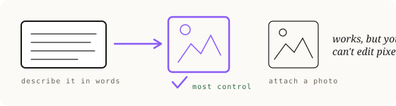
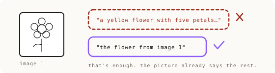

**When:** deciding whether each ingredient should be words, a picture, or both.
**Core moves:** Every ingredient can be defined with text, an image, or both (image plus a text delta). Use images for accuracy, text for interpretation. The Mixing Desk: six channels, each fader set to full text, full image, or hybrid. The golden rule, say it OR show it, never both: do not over-describe what images already show; be precise about the scene, light, and camera, and silent about what the attached photo already shows. One image, one job: never let a reference serve two purposes, and never use a source containing a competing version of what you are adding (the Polluted Source Rule). Visual Signal-to-Noise: crop sources to exactly what you want transferred.
**Full treatment:** https://dezygn.com/resources/visual-syntax

### Hierarchy of Attention
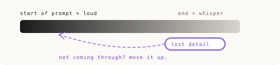

**When:** a critical detail keeps getting lost.
**Core moves:** Image models pay more attention to earlier tokens. Default order is the six-ingredient order; break it by moving a stubborn ingredient toward the front. The repetition trick: state a lost detail from more than one section. The attention budget: front-load what matters, do not spend early tokens on the obvious, put unusual requirements early. Measured: first sentence is roughly 2.5 to 3 times more accurate than buried later, and the middle is the worst position.
**Full treatment:** https://dezygn.com/resources/visual-syntax

### Tao of the Prompt
**When:** always, as the operating philosophy.
**Core moves:** The prompt, not the image, is the true artifact. A perfect prompt has no room for interpretation: complete, precise, absolute. Text-to-image is the highest-fidelity path (the Blueprint Principle); the photo is a crutch for what you cannot describe. Winning prompts are assets: the first approved image's prompt becomes the North Star master for the series, edited surgically one clause at a time, never rewritten, because you do not know which word is doing the heavy lifting. The doctrine is not "long" or "short", it is no token without a job.
**Full treatment:** https://dezygn.com/resources/visual-syntax
